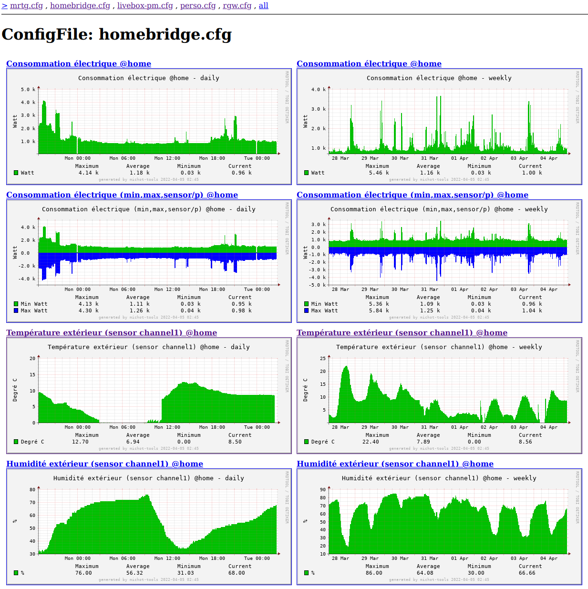
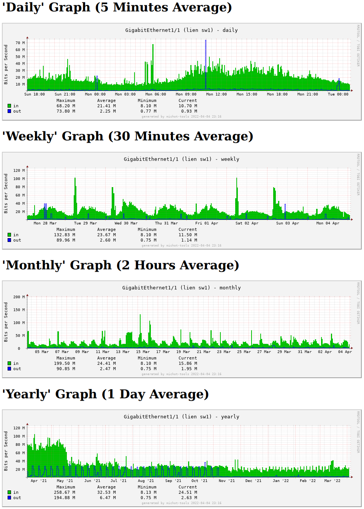

<h1>MRTG RRD GRAPH</h1>

  

The purpose of this small program is to generate html pages on the fly
from rrd files generated by MRTG. 

html and images are built in realtime, this mean no .html or .png file
stored on server.  
For a fast display with many small image, the html 
include inline png data.

This program is a rainy saturday project, but it may be useful to some 
people so i decide to publish it as a beerware.

 * "THE BEER-WARE LICENSE" 
 * jc@michot.fr write this file. As long as you retain this notice 
 * you can do whatever you want with this stuff.
 * If we meet some day, and you think this stuff is worth it, 
 * you can buy me a beer in return.

You only need to configure below the $mrtgconfigfiles with one or
several absolute path and filename for your mrtg configuration file.
(theses files must be readable by your web user running php script)

Syntax example:

[url]/mrtgrg.php 
[url]/mrtgrg.php?cfg=mrtg.cfg&target=port24 
[url]/mrtgrg.php?cfg=mrtg.cfg&target=port24&png=weekly 

 To manualy force width &| height 
 (this can also be configured inside mrtg config file):
 
[url]/mrtgrg.php?cfg=homebridge.cfg&target=power-home&png=weekly&width=1400&height=300

A new option is available in your MRTG config file:

    Rrd*Graph[ TARGET ]: 2waygraph,forcearea,forceday

    forceline: force display line/s
    forcearea: force display area/s
    forceday: do not use week number in month graph
    2waygraph: graph in/ou in 2 way (up/down a 0 line) (enable forcearea)
    autoscale: man rrdgraph
    autoscale-max: man rrdgraph
    autoscale-min: man rrdgraph
    
All test has been done with:
 FreeBSD and pkg mod_php74-7.4.27 php74-gd-7.4.23 php74-pecl-rrd-2.0.1_1
 

  

